# Real Estate Management System — Backend

A multi-tenant real estate management platform built with Spring Boot 3.5 and PostgreSQL. The system supports property listings, rental and sale workflows, lease contracts, payments, maintenance requests, lead management, notifications, and AI-powered features.

---

## Architecture Overview

The backend follows a layered architecture pattern with strict separation of concerns. Each layer communicates only with the layer directly below it, ensuring maintainability and testability.

```
Client (React)
      |
      | HTTP/REST
      v
Controllers  — receive and validate HTTP requests, delegate to services
             — extend BaseController for unified response handling (OOP/DRY)
Services     — contain all business logic, orchestrate data access
Repositories — data access layer using Spring Data JPA + JDBC
Entities     — JPA-mapped domain models
Database     — PostgreSQL with schema-based multi-tenancy
```

### Multi-Tenancy

The system implements schema-based multi-tenancy using Hibernate's `MultiTenantConnectionProvider` interface. Each company (tenant) gets its own isolated PostgreSQL schema at registration time. The `public` schema holds shared data — users, tenants, roles, permissions, refresh tokens. Every tenant schema holds per-company data — properties, contracts, payments, leads, notifications, and maintenance requests.

The tenant is identified from the JWT token on every request. The `JwtAuthFilter` extracts `tenantId`, `schemaName`, `userId`, and `role` from the token, sets them on `TenantContext` (a `ThreadLocal` wrapper), and Hibernate uses the schema name to route all queries to the correct schema automatically.

Schema provisioning runs via Flyway when a new tenant registers. Migrations in `db/migration/tenant` are applied to the new schema automatically. On application startup, `TenantMigrationService` runs pending migrations for all existing tenant schemas.

## How Multi-Tenancy Works

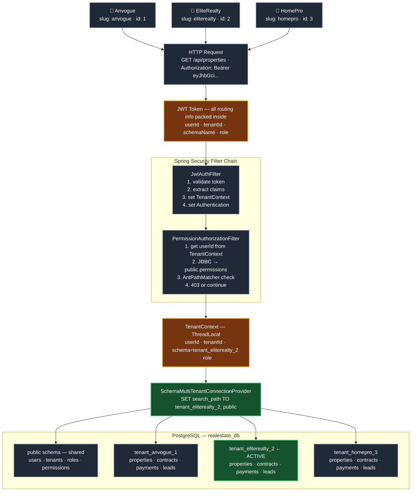
## Request Lifecycle — Real Estate Management System

---

### Frontend Overview

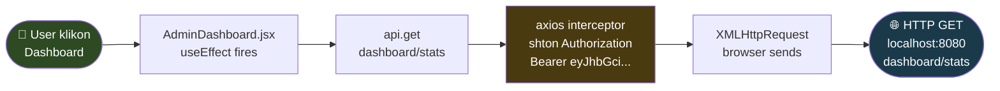

---

### Tomcat Acceptance

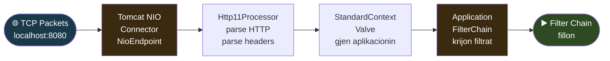

---

### Servlet Filter Chain

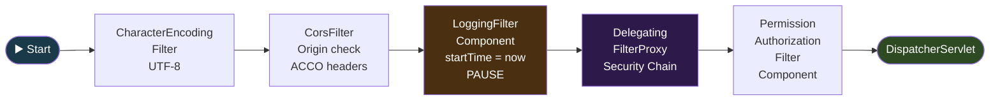

---

### Spring Security Filter Chain

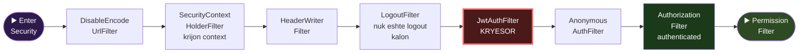

---

### JwtAuthFilter Details

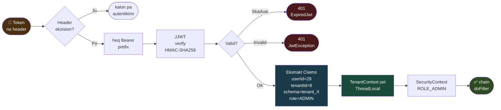

---

### PermissionAuthorizationFilter Details

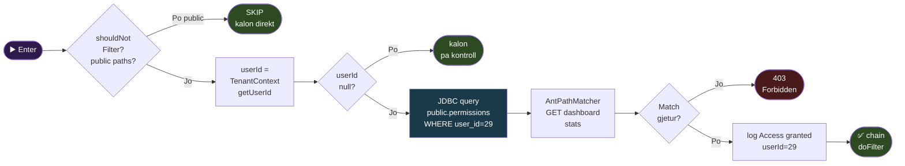

---

###  DispatcherServlet Controller Service

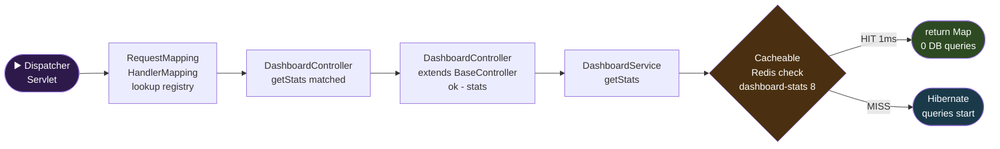

---

###  Multitenancy Schema Routing

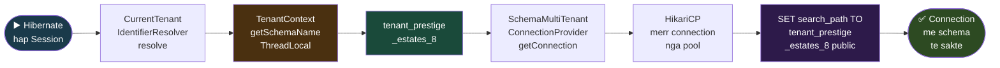

---

### DB Queries in Tenant Schema

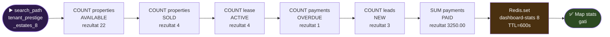

---

###  Response Returnes Back

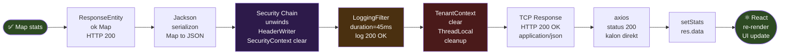

---

###  JWT Structure and Validation

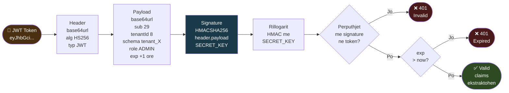

---

###  Access Token vs Refresh Token

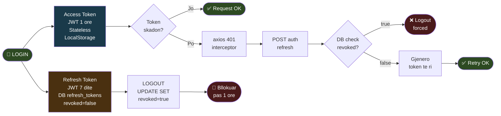

---

###  TenantContext ThreadLocal Lifecycle

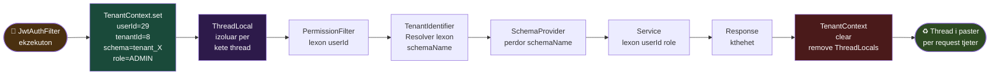

---

###  Multitenancy Isolation

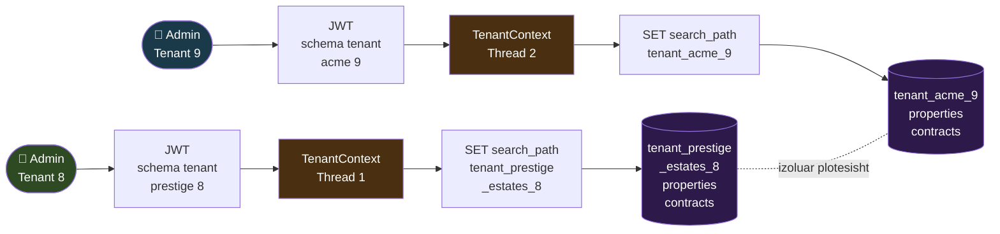

## Technology Stack

| Layer | Technology |
|---|---|
| Framework | Spring Boot 3.5 |
| Language | Java 21 |
| Database | PostgreSQL 15 |
| ORM | Hibernate / Spring Data JPA |
| Migrations | Flyway |
| Security | Spring Security + JWT (JJWT 0.12) |
| Authorization | Permission-Based RBAC (Middleware) |
| Caching | Redis (Spring Cache) |
| Background Jobs | Spring Scheduler |
| AI Integration | Groq API (llama-3.1-8b-instant) |
| Documentation | SpringDoc OpenAPI / Swagger UI |
| Build | Maven |

---

## Domain Model

The system is organized around these core domains:

**Properties** — The central entity. Properties have a type, status, listing type (SALE/RENT/BOTH), address, images, features, and price history. Agents create and manage properties. Full-text search is powered by PostgreSQL `tsvector` with a generated column.

**Rental Flow** — An agent creates a RentalListing for a property. Clients submit RentalApplications. When approved, the agent creates a LeaseContract. The contract generates commission Payment records automatically on activation.

**Sale Flow** — An agent creates a SaleListing. Clients submit SaleApplications. The agent creates a SaleContract. On completion, the system generates commission SalePayment records automatically based on whether the property came from a client lead (Scenario 1) or is company-owned (Scenario 2).

**Leads** — Clients submit PropertyLeadRequests expressing interest. Admins assign leads to agents. Agents accept (NEW to IN_PROGRESS), work on them, and close them (DONE or REJECTED). Agents can also decline a lead without rejecting it, which returns the lead to the unassigned pool.

**Payments and Commission** — When a LeaseContract is activated or a SaleContract is completed, the system automatically creates the correct payment records based on the commission model. Scenario 1 applies when the property was sold/rented by a client through the lead system (the original property owner gets a share). Scenario 2 applies to company-owned properties.

**Notifications** — Thirteen service triggers create notifications automatically across the system. MaintenanceService, LeaseContractService, SaleService, LeadService, and RentalService all inject NotificationService and create contextual notifications for agents, clients, and technicians at key workflow steps.

**AI Features** — Six AI-powered endpoints powered by the Groq API. Property description generation, price estimation, client chat assistant, contract summarizer, payment risk analysis, and lead-to-property matching.

---

### Registration — Invitation Only

The system uses invitation-only registration. Public signup is disabled.
Admins generate a secure single-use token via POST /api/invites, which 
produces a link in the format /register?token=abc123.

The token is stored in public.invite_tokens with a 7-day expiry and 
single-use enforcement. When a user registers, the token is marked as 
used inside the same @Transactional block as user creation — if 
registration fails, the token remains valid (automatic rollback).

Navigating to /register without a token redirects immediately to login.

---

## Authentication and Authorization

### Authentication
Authentication uses stateless JWT tokens. On login or register, the system returns an access token (1 hour) and a refresh token (7 days stored in the database). The `JwtAuthFilter` validates every request, extracts claims, populates `TenantContext`, and sets the Spring Security `Authentication` object.

### Authorization — Permission-Based RBAC
Authorization is enforced entirely through middleware — zero `@PreAuthorize` annotations in controllers. The system uses a database-driven RBAC model:

```
REQUEST
    ↓
JwtAuthFilter — validate token, set TenantContext
    ↓
PermissionAuthorizationFilter — query DB, check METHOD + PATH
    ↓
CONTROLLER — zero @PreAuthorize, zero authorization logic
```

Permissions are stored in the `public` schema and consist of an HTTP method and an API path pattern. `AntPathMatcher` handles wildcard matching (e.g. `/api/properties/*`). The permission check uses JDBC directly — not Hibernate — to avoid schema routing conflicts in the multi-tenant setup.

```sql
-- Structure
users → user_roles → roles → role_permissions → permissions(http_method, api_path)
```

Permissions can be granted or revoked at runtime without restarting the application. The `PermissionAdminController` exposes endpoints for managing roles and permissions dynamically.

Roles are `ADMIN`, `AGENT`, and `CLIENT`. Every new user is automatically added to `user_roles` on registration based on their assigned role.

---

## Permission-Based Authorization — RBAC

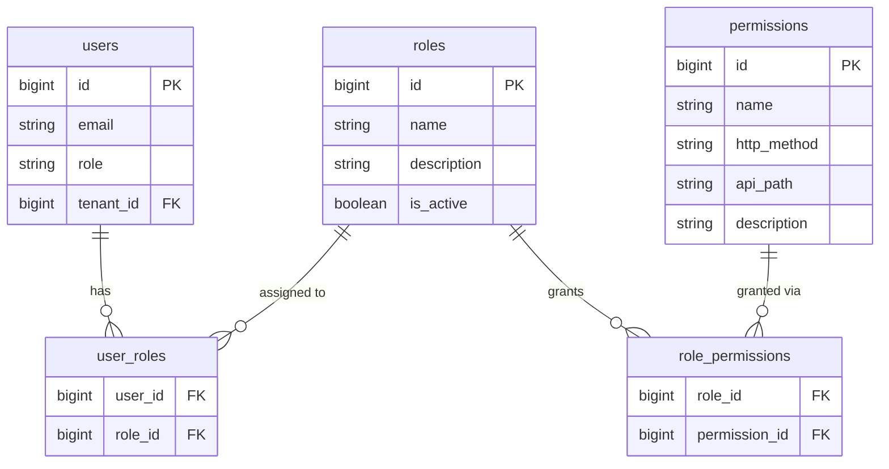

### How authorization flows at runtime

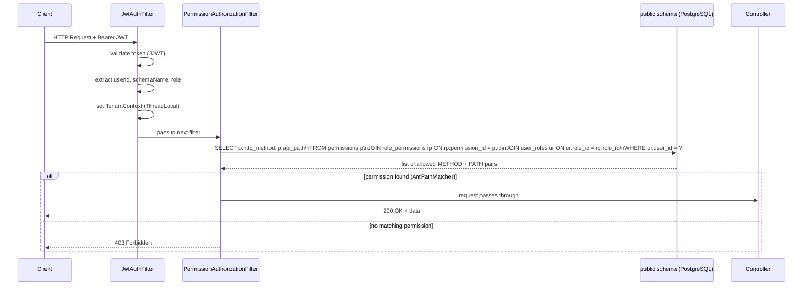

---

### Impersonation — Admin Acting as Agent/Client

Admins can impersonate any user within the same tenant via:

POST /api/auth/impersonate/{userId}

The endpoint returns a new JWT token scoped to the target user's 
role and schema. The token contains an additional claim 
(impersonated_by: adminId) for audit purposes. JwtAuthFilter 
logs a WARN when an impersonation token is detected:

IMPERSONATION ACTIVE — admin=7 acting as userId=15

Impersonation is tenant-scoped — admins cannot impersonate users 
from other tenants.

## Impersonation Lifecycle 

---

###  Impersonation Overview

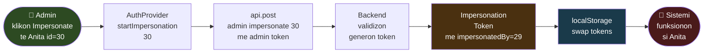

---

### Frontend — Before Request

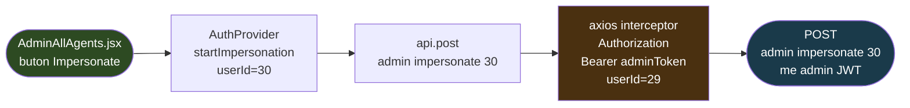

---

### Filter Chain with Admin Token

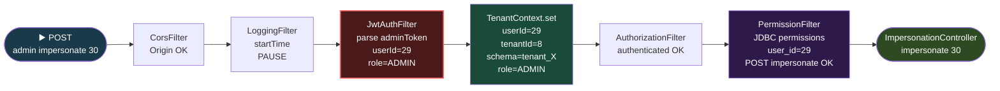

---

### ImpersonationController — Validation

```mermaid
flowchart LR
    A(["impersonate\nuserId=30"]) --> B{"TenantContext\ngetRole\n= ADMIN?"}
    B -->|"Jo"| C(["403\nOnly ADMIN\ncan impersonate"])
    B -->|"Po"| D["userRepository\nfindById 30\nSELECT public.users"]
    D --> E{"target.getRole\n= ADMIN?"}
    E -->|"Po"| F(["403\nCannot impersonate\nanother ADMIN"])
    E -->|"Jo AGENT"| G{"target.getTenant\n= TenantContext\ngetTenantId?"}
    G -->|"Jo cross-tenant"| H(["403\nCannot impersonate\ndifferent tenant"])
    G -->|"Po 8 = 8"| I["schemaRegistry\nfindByTenant_Id 8\nschema=tenant_X"]
    I --> J(["✅ Gjenero\nImpersonation Token"])

    style A fill:#2d4a22,color:#fff
    style C fill:#4a1a1a,color:#fff
    style F fill:#4a1a1a,color:#fff
    style H fill:#4a1a1a,color:#fff
    style J fill:#1a3a4a,color:#fff
```

---

### JWT Impersonation Token Generation

```mermaid
flowchart LR
    A(["✅ Validimi\nKaloi"]) --> B["jwtUtil\ngenerateImpersonation\nToken"]
    B --> C["Payload\nsub=30\nemail=anita\ntenantId=8\nschema=tenant_X\nrole=AGENT\nimpersonatedBy=29"]
    C --> D["HMACSHA256\nheader.payload\nSECRET_KEY"]
    D --> E["eyJhbGci...\nimpersonationToken"]
    E --> F["log.warn\nIMPERSONATION STARTED\nadmin=29\nimpersonating=30"]
    F --> G(["HTTP 200\ntoken\nemail\nrole\nfull_name"])

    style A fill:#2d4a22,color:#fff
    style C fill:#4a3010,color:#fff
    style E fill:#1a3a4a,color:#fff
    style F fill:#4a1a1a,color:#fff
    style G fill:#2d4a22,color:#fff
```

---

### Frontend — Token Swap

```mermaid
flowchart LR
    A(["HTTP 200\ndata.token\ndata.email\ndata.role"]) --> B["localStorage.set\nadmin_token\n= access_token backup"]
    B --> C["localStorage.set\nadmin_user_info\n= user_info backup"]
    C --> D["localStorage.set\naccess_token\n= impersonationToken"]
    D --> E["localStorage.set\nuser_info\nid=30 role=agent"]
    E --> F["localStorage.set\nimpersonating\nemail=anita role=AGENT"]
    F --> G["setUser\nimpersonatedUser"]
    G --> H["setImpersonating\nemail role"]
    H --> I(["window.location\nhref = /agent\nFULL RELOAD"])

    style A fill:#1a3a4a,color:#fff
    style B fill:#4a3010,color:#fff
    style C fill:#4a3010,color:#fff
    style D fill:#4a1a1a,color:#fff
    style I fill:#2d4a22,color:#fff
```

---

### During Impersonation — Every Request

```mermaid
flowchart LR
    A(["Çdo request\nsi Anita"]) --> B["axios interceptor\nAuthorization\nBearer impersonationToken"]
    B --> C["JwtAuthFilter\nparse token\nsub=30\nrole=AGENT\nimpersonatedBy=29"]
    C --> D["log.warn\nIMPERSONATION ACTIVE\nadmin=29 acting\nas userId=30"]
    D --> E["TenantContext.set\nuserId=30\nrole=AGENT\nschema=tenant_X"]
    E --> F["PermissionFilter\nJDBC permissions\nuser_id=30\nAGENT permissions"]
    F --> G(["Sistemi funksionon\nplotesisht si Anita\nAGENT permissions only"])

    style A fill:#4a1a1a,color:#fff
    style C fill:#4a3010,color:#fff
    style D fill:#4a1a1a,color:#fff,stroke:#ff6b6b,stroke-width:2px
    style E fill:#1a4a3a,color:#fff
    style G fill:#2d4a22,color:#fff
```

---

### Exit Impersonation — Frontend

```mermaid
flowchart LR
    A(["👤 Admin klikon\nStop Impersonating"]) --> B["AuthProvider\nexitImpersonation"]
    B --> C["api.post\nadmin impersonate exit\nme impersonationToken"]
    C --> D["Backend log.info\nIMPERSONATION EXIT\nuserId=30\nreturn 204"]
    D --> E["localStorage.set\naccess_token\n= admin_token restore"]
    E --> F["localStorage.set\nuser_info\n= admin_user_info restore"]
    F --> G["localStorage.remove\nadmin_token\nadmin_user_info\nimpersonating"]
    G --> H["setUser\nadminUserInfo"]
    H --> I["setImpersonating\nnull"]
    I --> J(["window.location\nhref = /admin\nFULL RELOAD"])

    style A fill:#2d4a22,color:#fff
    style D fill:#1a3a4a,color:#fff
    style E fill:#4a3010,color:#fff
    style G fill:#4a1a1a,color:#fff
    style J fill:#2d4a22,color:#fff
```

---

### After Exit - Admin is back

```mermaid
flowchart LR
    A(["Çdo request\npas exit"]) --> B["axios interceptor\nAuthorization\nBearer adminToken\noriginal"]
    B --> C["JwtAuthFilter\nparse adminToken\nsub=29\nrole=ADMIN\nimpersonatedBy=null"]
    C --> D{"impersonatedBy\nnull?"}
    D -->|"Po"| E["TenantContext.set\nuserId=29\nrole=ADMIN\nschema=tenant_X"]
    D -->|"Jo"| F["log.warn\nIMPERSONATION ACTIVE"]
    E --> G["PermissionFilter\nADMIN permissions\nplots"]
    G --> H(["✅ Admin\ni rikthyer\nplotesisht"])

    style A fill:#2d4a22,color:#fff
    style C fill:#4a3010,color:#fff
    style E fill:#1a4a3a,color:#fff
    style F fill:#4a1a1a,color:#fff
    style H fill:#2d4a22,color:#fff
```

---

## localStorage State

## Para / Gjate / Pas Impersonation

```mermaid
flowchart LR
    subgraph PARA[Para Impersonation]
        A1["access_token\nadminToken\nuserId=29"]
        A2["refresh_token\nadminRefresh"]
        A3["user_info\nid=29 role=admin"]
    end

    subgraph GJATE[Gjate Impersonation]
        B1["access_token\nimpersonToken\nuserId=30"]
        B2["refresh_token\nadminRefresh"]
        B3["user_info\nid=30 role=agent"]
        B4["admin_token\nBACKUP adminToken"]
        B5["admin_user_info\nBACKUP id=29"]
        B6["impersonating\nemail=anita\nrole=AGENT"]
    end

    subgraph PAS[Pas Exit]
        C1["access_token\nadminToken\nuserId=29"]
        C2["refresh_token\nadminRefresh"]
        C3["user_info\nid=29 role=admin"]
    end

    A1 --> B1
    A2 --> B2
    A3 --> B3
    B4 --> C1
    B2 --> C2
    B5 --> C3

    style B1 fill:#4a1a1a,color:#fff
    style B4 fill:#4a3010,color:#fff
    style B5 fill:#4a3010,color:#fff
    style B6 fill:#4a1a1a,color:#fff
    style A1 fill:#1a3a4a,color:#fff
    style A2 fill:#1a3a4a,color:#fff
    style A3 fill:#1a3a4a,color:#fff
    style C1 fill:#2d4a22,color:#fff
    style C2 fill:#2d4a22,color:#fff
    style C3 fill:#2d4a22,color:#fff
```

---

### Security 

```mermaid
flowchart LR
    A(["POST\nimpersonate\nuserId"]) --> B{"Kush\nben kerkesen?"}
    B -->|"Jo ADMIN"| C(["403\nOnly ADMIN\ncan impersonate"])
    B -->|"ADMIN"| D{"Target\eshte ADMIN?"}
    D -->|"Po"| E(["403\nCannot impersonate\nADMIN"])
    D -->|"Jo"| F{"Same\nTenant?"}
    F -->|"Jo"| G(["403\nCross-tenant\nbllokuar"])
    F -->|"Po"| H["✅ Te gjitha\nkontrollet kaluan"]
    H --> I["Gjenero token\nme impersonatedBy\nclaim per audit"]
    I --> J(["Token i ri\njeton 1 ore\nautomatik skadon"])

    style C fill:#4a1a1a,color:#fff
    style E fill:#4a1a1a,color:#fff
    style G fill:#4a1a1a,color:#fff
    style H fill:#2d4a22,color:#fff
    style J fill:#1a3a4a,color:#fff
```
---

## BaseController — OOP/DRY Pattern

All controllers except `AuthController` extend `BaseController`, which centralizes common response-building logic:

```java
public abstract class BaseController {
    protected <T> ResponseEntity<T> ok(T body)          // 200 OK
    protected <T> ResponseEntity<T> created(T body)     // 201 Created
    protected ResponseEntity<Void> noContent()           // 204 No Content
    protected PageRequest page(int page, int size)
    protected PageRequest page(int page, int size, String sortBy, String sortDir)
}
```

This eliminates repeated `ResponseEntity.ok(...)`, `PageRequest.of(...)`, and `HttpStatus.CREATED` boilerplate across all controllers — roughly 30-40% less code per controller — with zero impact on endpoints, Swagger documentation, or frontend behavior.

`AuthController` does not extend `BaseController` because it contains specific logic (`getClientIp()`) that belongs only to the authentication flow.

---

## Caching — Redis

Notification counts, and dashboard statistics 
are cached in Redis with a 10-minute TTL:

User → GET /api/dashboard/stats → miss → aggregate DB queries → cache per tenant
User → GET /api/dashboard/stats → hit  → return from Redis (cache key = tenantId)

@Cacheable is applied to read-heavy endpoints. @CacheEvict invalidates 
the cache automatically on create, update, and delete operations.
Dashboard stats cache is evicted automatically when underlying data changes.
@EnableCaching is configured on BackendApplication.

---

## Background Jobs — Spring Scheduler

Four scheduled jobs run automatically in the background across all active tenant schemas:

| Job | Schedule | Action |
|---|---|---|
| `markOverduePayments` | Daily 00:00 | Marks PENDING payments past due date as OVERDUE |
| `checkExpiringContracts` | Daily 08:00 | Logs contracts expiring within 30 days |
| `logSystemStats` | Every 6 hours | Logs active lease count per tenant |
| `healthCheck` | Every 60 seconds | Logs active schema count |

Each job iterates all provisioned tenant schemas, sets `TenantContext`, executes the operation, and clears the context in a `finally` block. `@EnableScheduling` is configured on `BackendApplication`.

---

## Commission Logic

**Rental (triggered on LeaseContract PENDING_SIGNATURE to ACTIVE):**

```
Commission Total = Monthly Rent x 3%
Owner Amount     = Monthly Rent x 97%

Scenario 1 (property came from a completed lead):
  RENT                 -> property owner (97%)
  COMMISSION 50%       -> company
  AGENT_COMMISSION 40% -> agent
  CLIENT_BONUS 10%     -> property owner

Scenario 2 (company-owned property):
  RENT                 -> company (97%)
  COMMISSION 60%       -> company
  AGENT_COMMISSION 40% -> agent
```

**Sale (triggered on SaleContract PENDING to COMPLETED):**

Same structure as rental but applied to the total sale price instead of monthly rent.

---

## API Overview

The API exposes over 60 REST endpoints. All endpoints require a Bearer JWT token except `/api/auth/**`.

| Module | Base Path |
|---|---|
| Authentication | /api/auth |
| Properties | /api/properties |
| Property Images | /api/properties/{id}/images |
| Rental Listings | /api/rentals/listings |
| Rental Applications | /api/rentals/applications |
| Lease Contracts | /api/contracts/lease |
| Payments | /api/payments |
| Sale Listings | /api/sales/listings |
| Sale Applications | /api/sales/applications |
| Sale Contracts | /api/sales/contracts |
| Sale Payments | /api/sales/payments |
| Leads | /api/leads |
| Maintenance | /api/maintenance |
| Notifications | /api/notifications |
| Users and Profiles | /api/users |
| Tenants | /api/admin/tenants |
| Permission Management | /api/admin |
| AI Features | /api/ai |

Full interactive documentation is available at `http://localhost:8080/swagger-ui.html` when the application is running.

---

## Setup and Running

### Prerequisites

- Java 21
- Maven 3.9+
- PostgreSQL 15+
- Redis 7+

### Database Setup

```sql
CREATE USER realestate_user WITH PASSWORD 'realestate_pass';
CREATE DATABASE realestate_db OWNER realestate_user;
GRANT ALL PRIVILEGES ON DATABASE realestate_db TO realestate_user;
```

### Configuration

The application reads from `src/main/resources/application.yml`. Key configuration values:

```yaml
spring:
  datasource:
    url: jdbc:postgresql://localhost:5433/realestate_db
    username: realestate_user
    password: realestate_pass
  cache:
    type: redis
    redis:
      time-to-live: 600000
  data:
    redis:
      host: localhost
      port: 6379

jwt:
  secret: your-256-bit-secret-key-minimum-32-characters
  expiration-ms: 3600000
  refresh-expiration-ms: 604800000

groq:
  api:
    key: your-groq-api-key   # use "placeholder" for mock responses

app:
  upload:
    dir: ./uploads
```

### Running

```bash
mvn spring-boot:run
```

Flyway runs automatically on startup and applies all pending migrations. New tenant schemas are provisioned on first registration.

---

## Key Design Decisions

**Schema isolation over row-level security** — Each tenant gets a fully isolated PostgreSQL schema. This eliminates the risk of data leakage between tenants through query bugs and makes it straightforward to back up or delete a single tenant's data without affecting others.

**Cross-schema foreign keys via Long columns** — Entities that reference `public.users` (such as `agent_id`, `client_id`) store the ID as a plain `Long` column rather than a JPA `@ManyToOne`. This avoids Hibernate attempting to join across schema boundaries, which would fail at the connection level.

**JWT contains all routing information** — The token carries `userId`, `tenantId`, `schemaName`, and `role`. This means every request is self-contained. No database lookup is needed to identify the tenant or authorize the user at the filter level.

**JDBC direct in security middleware** — `PermissionAuthorizationFilter` and `PermissionRepository` use JDBC directly instead of JPA/Hibernate. This prevents Hibernate from applying the tenant `search_path` to permission queries, which must always read from the `public` schema regardless of the current tenant context.

**Permission-based authorization over @PreAuthorize** — Permissions are stored in the database and checked at the middleware level. This means access control can be modified at runtime without code changes or application restarts. Granting or revoking a permission is a single SQL statement.

**Commission payments are immutable records** — When a contract completes, the system creates explicit Payment or SalePayment rows for each recipient. These records are never modified retroactively. This creates a clear audit trail of who received what and when.

**Soft deletes on core entities** — Properties, rental listings, and sale listings use a `deleted_at` timestamp column instead of hard deletes. All queries filter by `deleted_at IS NULL`. This preserves historical data and prevents orphaned references in contracts and applications.

**JDBC direct in security middleware — `PermissionAuthorizationFilter` and `PermissionRepository` use raw JDBC via `DataSource` instead of extending `JpaRepository` for three reasons: (1) Hibernate routes all queries through `CurrentTenantIdentifierResolver` which would apply the tenant `search_path` to permission tables that must always read from `public`; (2) the filter executes before any Spring-managed transaction exists, making `EntityManager` unavailable; (3) raw JDBC skips JPQL parsing, entity mapping, and schema resolution — reducing overhead on the most frequently called query in the application.

**BaseController for response consistency** — All controllers extend `BaseController` which provides unified helpers for building HTTP responses. This enforces consistent response patterns across the entire API and reduces boilerplate by 30-40% per controller with zero impact on endpoints or Swagger documentation.
